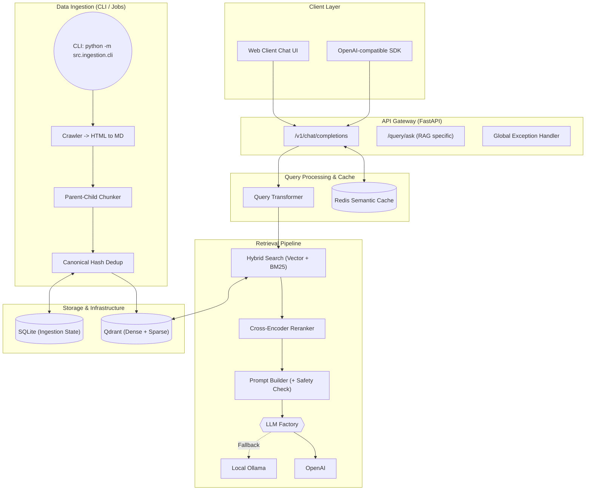

# 🇩🇪 German Visa & Chancenkarte RAG API

[](https://www.python.org/downloads/)
[](https://fastapi.tiangolo.com)
[](https://qdrant.tech/)
[](https://redis.io/)
[](https://opensource.org/licenses/MIT)

An **Advanced RAG (Retrieval-Augmented Generation)** API system designed to answer complex legal and application questions regarding German Visas and the "Chancenkarte" (Opportunity Card). The system natively supports queries in English, German, and Chinese, ensuring all generated answers are strictly grounded in authoritative, official sources with precise citations.

Built with **Production-ready** standards, this project features an automated web ingestion pipeline, canonical state deduplication, Hybrid Search, Cross-Encoder Reranking, LLM-based query transformation, **Redis Semantic Caching**, and a complete CI/CD workflow.

## ✨ Core Features

### 🔍 Advanced RAG Pipeline
- **Query Transformation**: Utilizes a lightweight LLM for intent expansion and spell-checking to solve multi-lingual vector space misalignment.
- **Hybrid Search**: Combines **Dense Vectors** (OpenAI `text-embedding-3-small`) with **Sparse BM25** search via Qdrant.
- **Cross-Encoder Reranking**: Fetches Top-20 candidates and reranks them using a Cross-Encoder API to distill the precise Top-5 chunks.
- **Time-Aware & Authority Weighting**: Prioritizes official government sources and recently fetched documents during retrieval scoring.

### 🚀 Performance & Cost Optimization
- **Semantic Caching**: Integrates Redis to cache LLM responses based on deterministic query hashing. Delivers **~10ms response times** for repeated queries.
- **Enhanced Parent-Child Chunking**: Implements a "Small-to-Big" strategy with **Title Context Injection** and **Noise Removal** (strips images/boilerplate) for 80% cleaner RAG context.

### 🛠️ Engineering Excellence
- **LLM Factory Pattern (Local Fallback)**: Implements dependency inversion. If the OpenAI API key is missing or offline, the system seamlessly falls back to a local **Ollama** model (ideal for local resilience testing).
- **Standalone CLI Ingestion Script**: Decouples the ETL pipeline from the Web API. The provided CLI perfectly aligns with Serverless environments (e.g., GCP Cloud Run Jobs) to prevent CPU throttling during web crawling.
- **OpenAI-Compatible API**: Fully implements the `POST /v1/chat/completions` endpoint with SSE Streaming support.
- **Defensive Programming**: Built-in Prompt Injection detection and a Global Exception Handler.

---

## 🏗️ System Architecture



---

## 🚀 Quick Start (Local Development)

### 1. Setup
```bash
git clone https://github.com/yourusername/german-visa-rag.git
cd german-visa-rag
cp .env.example .env
# Edit .env and insert your OPENAI_API_KEY
```

### 2. Spin Up Services
```bash
docker-compose up -d
curl -H "X-API-Key: dev-key-12345" http://localhost:8000/v1/health
```

### 3. Trigger Data Ingestion (CLI)
Use the dedicated CLI tool to trigger the web crawler and ETL pipeline:
```bash
# Ingest all URLs from config
python -m src.ingestion.cli ingest

# Auto-discover and ingest all pages from defined domains
python -m src.ingestion.cli ingest --auto-discover

# Force re-ingestion and apply new processing logic to existing docs
python -m src.ingestion.cli ingest --auto-discover --force

# Test ingestion on a single URL
python -m src.ingestion.cli ingest --source "https://www.make-it-in-germany.com/en/"
```

---

## 💻 API Usage Example

The API is strictly OpenAI-compatible. You can point the official Python SDK directly to your local instance.

```python
from openai import OpenAI

client = OpenAI(
    api_key="dev-key-12345",
    base_url="http://localhost:8000/v1"
)

response = client.chat.completions.create(
    model="gpt-4o-mini",
    messages=[{"role": "user", "content": "What are the requirements for the Chancenkarte?"}],
    stream=True
)

for chunk in response:
    print(chunk.choices.delta.content or "", end="")
```

---

## 🧪 Testing & Evaluation (MLOps)

```bash
docker-compose exec api bash

# 1. Run Tests & Coverage
pytest tests/ -v --cov=src --cov-report=term-missing

# 2. Run Ragas Pipeline Evaluation
python -m eval.ragas_evaluator eval/eval_dataset.json
```

---

## ☁️ Deployment

Designed for stateless deployment on **GCP Cloud Run (API)** and **GCP Cloud Run Jobs (CLI)** backed by **Qdrant Cloud** and **Redis Cloud**.

```bash
./scripts/deploy.sh -e production -p your-gcp-project-id -r europe-west1
```

---

## ⚠️ Disclaimer
**This project is built for technical demonstration purposes (Side Project)**. All answers are generated by AI and **do not constitute legal advice**. Always refer to official announcements from the [Federal Foreign Office](https://www.auswaertiges-amt.de/en) or [Make it in Germany](https://www.make-it-in-germany.com/en/).
