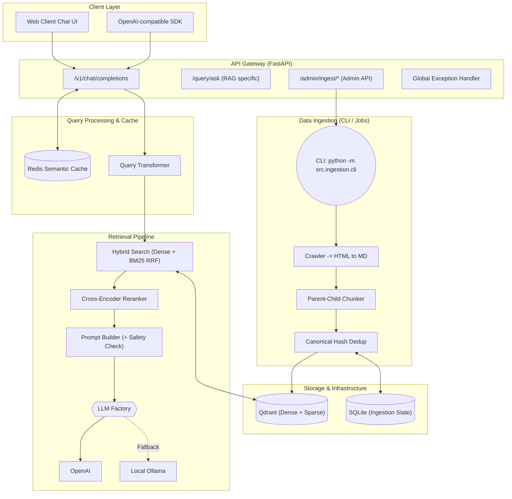

# 🇩🇪 German Visa & Chancenkarte RAG API

[](https://www.python.org/downloads/)
[](https://fastapi.tiangolo.com)
[](https://qdrant.tech/)
[](https://redis.io/)
[](https://opensource.org/licenses/MIT)

An **Advanced RAG (Retrieval-Augmented Generation)** API system designed to answer complex legal and application questions regarding German Visas and the "Chancenkarte" (Opportunity Card). The system natively supports queries in English, German, and Chinese, ensuring all generated answers are strictly grounded in authoritative, official sources with precise citations.

Built with **Production-ready** standards, this project features an automated web ingestion pipeline, canonical state deduplication, Hybrid Search, Cross-Encoder Reranking, LLM-based query transformation, **Redis Semantic Caching**, and a complete CI/CD workflow.

## ✨ Core Features

### 🔍 Advanced RAG Pipeline
- **Query Transformation**: Utilizes a lightweight LLM for intent expansion and spell-checking to solve multi-lingual vector space misalignment. Generates `german_query`, `english_query`, and `query_variants` simultaneously, searching across all of them for maximum recall.
- **Hybrid Search**: Combines **Dense Vectors** (OpenAI `text-embedding-3-small`) with **Sparse BM25** search via Qdrant, fused using server-side **Reciprocal Rank Fusion (RRF)**. The BM25 Sparse Encoder is custom-built and hash-based, serving as a zero-dependency design decision that doesn't rely on any external models or training corpora.
- **Cross-Encoder Reranking**: Fetches Top-20 candidates (`RETRIEVAL_TOP_K_HYBRID=20`) and reranks them using a Cross-Encoder API to distill the precise Top-10 chunks (`RETRIEVAL_TOP_K_RERANKED=10`).
- **Time-Aware & Authority Weighting**: Prioritizes official government sources and recently fetched documents during retrieval scoring.

### 🚀 Performance & Cost Optimization
- **Semantic Caching**: Integrates Redis to cache LLM responses based on deterministic query hashing. Delivers **~10ms response times** for repeated queries.
- **Enhanced Parent-Child Chunking**: Implements a "Small-to-Big" strategy with **Title Context Injection** and **Noise Removal** (strips images/boilerplate) for 80% cleaner RAG context.

### 🛠️ Engineering Excellence
- **LLM Factory Pattern (Local Fallback)**: Implements dependency inversion. If the OpenAI API key is missing or offline, the system seamlessly falls back to a local **Ollama** model (ideal for local resilience testing).
- **Standalone CLI Ingestion Script**: Decouples the ETL pipeline from the Web API. The provided CLI perfectly aligns with Serverless environments (e.g., GCP Cloud Run Jobs) to prevent CPU throttling during web crawling.
- **OpenAI-Compatible API**: Fully implements the `POST /v1/chat/completions` endpoint with SSE Streaming support.
- **Defensive Programming**: Built-in Prompt Injection detection, a Global Exception Handler, and a Fixed-Window Rate Limiter for the API backend.

---

## 🏗️ System Architecture


```mermaid
graph TB
    subgraph "Client Layer"
        A1["Web Client Chat UI"]
        A2["OpenAI-compatible SDK"]
    end

    subgraph "API Gateway (FastAPI)"
        B1["/v1/chat/completions"]
        B2["/query/ask (RAG specific)"]
        B3["/admin/ingest/* (Admin API)"]
        EH["Global Exception Handler"]
    end

    subgraph "Query Processing & Cache"
        C1["Query Transformer"]
        E2[("Redis Semantic Cache")]
    end

    subgraph "Retrieval Pipeline"
        D1["Hybrid Search (Dense + BM25 RRF)"]
        D2["Cross-Encoder Reranker"]
        D3["Prompt Builder (+ Safety Check)"]
        F1{{"LLM Factory"}}
        LLM_A["OpenAI"]
        LLM_B["Local Ollama"]
    end

    subgraph "Data Ingestion (CLI / Jobs)"
        G0(("CLI: python -m src.ingestion.cli"))
        G1["Crawler -> HTML to MD"]
        G2["Parent-Child Chunker"]
        G3["Canonical Hash Dedup"]
    end

    subgraph "Storage & Infrastructure"
        E1[("Qdrant (Dense + Sparse)")]
        E3[("SQLite (Ingestion State)")]
    end

    A1 --> B1
    A2 --> B1
    B1 <--> E2
    B1 --> C1 --> D1 --> D2 --> D3
    D3 --> F1
    F1 --> LLM_A
    F1 -. Fallback .-> LLM_B
    D1 <--> E1
    B3 --> G0

    G0 --> G1 --> G2 --> G3 --> E1
    G3 <--> E3
```

---

## 🚀 Quick Start (Local Development)

### 1. Setup
```bash
git clone https://github.com/yourusername/german-visa-rag.git
cd german-visa-rag
cp .env.example .env
# Edit .env and insert your OPENAI_API_KEY
```

### 2. Diagnostic Tools (Optional but Recommended)
Before starting the system, you can verify your API connectivity and quota status (OpenAI/Azure):
```bash
# Verify connectivity and check rate limits/quota
export PYTHONPATH=$PYTHONPATH:$(pwd) && python scripts/test_provider.py
```
This script will tell you if your API key is valid and, if you are rate-limited, exactly how many seconds until reset.

### 3. Spin Up Services

*💡 Note: When using volume mounts during local development, please ensure the `src/__pycache__` directory on your host machine is cleared or properly ignored in `.dockerignore` to prevent stale `.pyc` files from causing service crashes.*

```bash
docker-compose up -d
curl -H "X-API-Key: dev-key-12345" http://localhost:8080/v1/health
```

### 4. Build & Run Frontend (Optional Manual Setup)
If you want to run the API without Docker or during development, you must build the frontend and move it to the `static` directory so the FastAPI server can serve it:
```bash
cd frontend
npm install
npm run build
cd ..
mkdir -p static
cp -r frontend/dist/* static/
# Now start the API
python src/main.py
```

### 5. Trigger Data Ingestion (CLI)
Use the dedicated CLI tool to trigger the web crawler and ETL pipeline:
```bash
# Ingest all URLs from config
python -m src.ingestion.cli ingest

# Auto-discover and ingest all pages from defined domains
python -m src.ingestion.cli ingest --auto-discover

# Force re-ingestion and apply new processing logic to existing docs
python -m src.ingestion.cli ingest --auto-discover --force

# Test ingestion on a single URL
python -m src.ingestion.cli ingest --source "https://www.make-it-in-germany.com/en/"

# Dry-run: Discover URLs without crawling
python -m src.ingestion.cli discover --domain "www.make-it-in-germany.com"

# Check ingestion statistics
python -m src.ingestion.cli status
```

---

## 💻 API Usage Example

The API is strictly OpenAI-compatible. You can point the official Python SDK directly to your local instance.

```python
from openai import OpenAI

client = OpenAI(
    api_key="dev-key-12345",
    base_url="http://localhost:8080/v1"
)

response = client.chat.completions.create(
    model="gpt-4o-mini",
    messages=[{"role": "user", "content": "What are the requirements for the Chancenkarte?"}],
    stream=True
)

for chunk in response:
    print(chunk.choices[0].delta.content or "", end="")

*💡 Tip: If you send the same question consecutively, the system will automatically hit the Redis cache, consuming zero API tokens!*

# 📡 SSE Response Structure (for UI Developers)
The streaming response uses standard SSE. Each chunk is a JSON object prefixed with `data: `.
Aside from message content, the system emits "Thinking" metadata:

| Metadata Field | Type | Description |
| :--- | :--- | :--- |
| `status` | `string` | Pipeline stage: `analyzing`, `retrieving`, `extracting`, `synthesizing` |
| `search_queries` | `list` | The specific queries generated by the AI to search the database |
| `sources` | `list` | List of retrieved documents with `url`, `title`, and `authority` |
| `achieved_milestone`| `object` | Detected progress update: `{ "id": "1-1", "status": "completed" }` |
| `updated_requirement`| `object` | Extracted user data: `{ "id": "age", "value": "30", "status": "valid" }` |
```

---

## 🧪 Testing & Evaluation (MLOps)

```bash
docker-compose exec api bash

# 1. Run Tests & Coverage
# Note: Ensure pytest is installed in the container (pip install .[test]), or run directly on the host with .venv/bin/python -m pytest.
# The test suite consists of 135 tests (130 unit tests with full mocking, 5 integration tests connecting to real services).
pip install .[test]
pytest tests/ -v --cov=src --cov-report=term-missing

# 2. Run Ragas Pipeline Evaluation
python -m eval.ragas_evaluator eval/eval_dataset.json
```

---

## ☁️ Deployment

Designed for stateless deployment on **GCP Cloud Run (API)** and **GCP Cloud Run Jobs (CLI)** backed by **Qdrant Cloud** and **Redis Cloud**.

```bash
./scripts/deploy.sh -e production -p your-gcp-project-id -r europe-west1
```
For detailed deployment steps, please refer to the [Deployment Guide (DEPLOYMENT.md)](docs/DEPLOYMENT.md).

---

## ⚠️ Disclaimer
**This project is built for technical demonstration purposes (Side Project)**. All answers are generated by AI and **do not constitute legal advice**. Always refer to official announcements from the [Federal Foreign Office](https://www.auswaertiges-amt.de/en) or [Make it in Germany](https://www.make-it-in-germany.com/en/).
