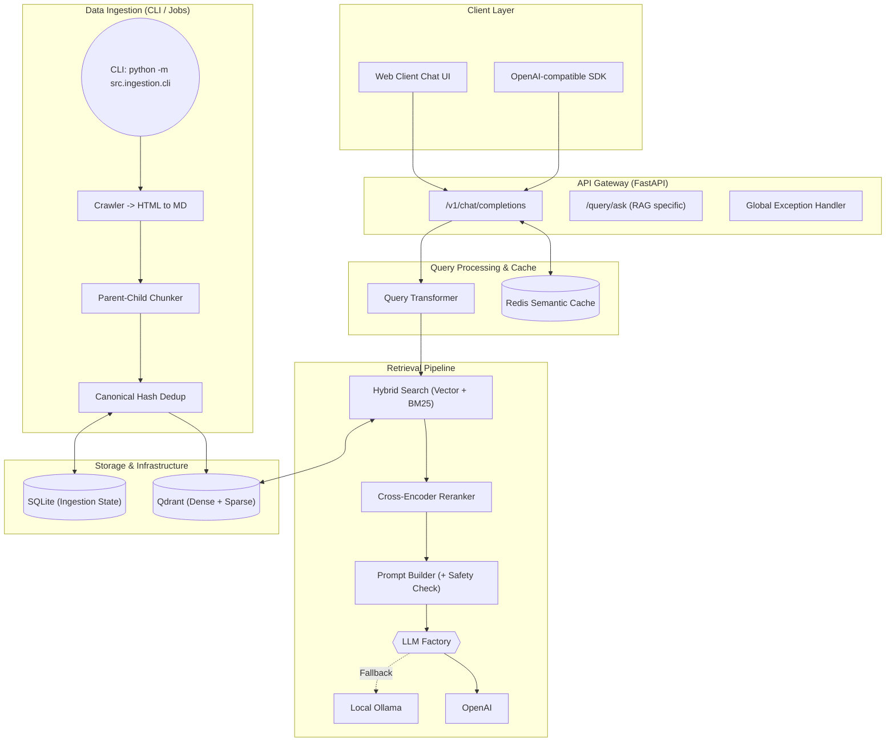

# 🇩🇪 German Visa & Chancenkarte RAG API

[](https://www.python.org/downloads/)
[](https://fastapi.tiangolo.com)
[](https://qdrant.tech/)
[](https://redis.io/)
[](https://opensource.org/licenses/MIT)

這是一個基於 **進階 RAG (Retrieval-Augmented Generation)** 架構的 API 系統，專門用於解答關於「德國簽證」與「機會卡 (Chancenkarte)」的法規與申請問題。系統支援中、英、德三語提問，並確保所有回答皆基於權威官方來源，附帶精確的引用出處。

本專案依照 **Production-ready** 標準打造，包含自動化網頁爬蟲、狀態去重、混合檢索 (Hybrid Search)、二次重排 (Reranking)、LLM 意圖擴充、**Redis 語意快取**，以及完整的評測與 CI/CD 流程。

## ✨ 核心特色

### 🔍 進階 RAG 檢索管線
- **Query Transformation**：使用輕量 LLM 進行查詢意圖擴充與拼字修正，解決多語系向量偏移問題。
- **Hybrid Search**：結合 **Dense Vector** (OpenAI `text-embedding-3-small`) 與 **Sparse BM25** 進行混合檢索。
- **Cross-Encoder Reranking**：檢索 Top-20 後，使用 Reranker 進行語意重排，精確提取 Top-5 丟給 LLM。
- **時間感知與權威加權**：優先檢索官方 (Official) 來源與最新抓取的法規文件。

### 🚀 效能優化與成本控制 (Performance & Cost)
- **Semantic Caching (語意快取)**：整合 Redis 實作 LLM 回答快取，針對重複問題達到 **10 毫秒級**回應，大幅降低 OpenAI Token 成本並支援快取流式 (Streaming) 模擬輸出。
- **Parent-Child Chunking**：以 H2/H3 標題切分 Parent Context，再以句子切分 Child Chunks 進行 Embedding，提供完整的 LLM 上下文。

### 🛠️ 工程最佳實踐 (Engineering Excellence)
- **LLM Factory Pattern (本地備援機制)**：實作依賴反轉，當 OpenAI API 失效或未設定時，系統可無縫切換至本地 **Ollama** 模型（僅限 Local 開發），提高開發韌性。
- **獨立 CLI 爬蟲腳本**：將 API 與 ETL (Extract, Transform, Load) 爬蟲解耦。提供專屬的 CLI 指令，完美適配 GCP Cloud Run Job 的 Serverless 排程架構，避免 CPU Throttling。
- **OpenAI 相容 API**：完整實作 `POST /v1/chat/completions`，支援 SSE Streaming。
- **防禦性編程**：內建 Prompt Injection 偵測與全局例外處理 (Global Exception Handler)。

---

## 🏗️ 系統架構



---

## 🚀 快速開始 (Local Development)

### 1. 環境初始化
```bash
git clone https://github.com/yourusername/german-visa-rag.git
cd german-visa-rag
cp .env.example .env
# 請編輯 .env 並填入 OPENAI_API_KEY
# (若不填寫且開啟 USE_OLLAMA=true，系統將自動退避至本地模型)
```

### 2. 啟動服務
```bash
docker-compose up -d
curl -H "X-API-Key: dev-key-12345" http://localhost:8000/v1/health
```

### 3. 觸發資料攝入 (CLI 獨立腳本)
本專案提供專業的 CLI 工具來執行資料爬取，適合打包為 Cronjob 或 Serverless Job：
```bash
# 抓取設定檔中的所有網址
python -m src.ingestion.cli ingest

# 僅抓取單一網址測試
python -m src.ingestion.cli ingest --source "https://www.make-it-in-germany.com/en/"
```

---

## 💻 API 使用範例

本專案高度相容 OpenAI SDK，您可以直接將 Base URL 指向本地服務。

```python
from openai import OpenAI

client = OpenAI(
    api_key="dev-key-12345",
    base_url="http://localhost:8000/v1" # 指向本地 RAG API
)

response = client.chat.completions.create(
    model="gpt-4o-mini",
    messages=[{"role": "user", "content": "Chancenkarte 的申請條件是什麼？"}],
    stream=True
)

for chunk in response:
    print(chunk.choices.delta.content or "", end="")
```
*💡 提示：如果連續發送相同問題，系統將自動命中 Redis 快取，不消耗任何 API Token！*

---

## 🧪 測試與評測 (Testing & MLOps)

```bash
# 進入開發容器
docker-compose exec api bash

# 1. 執行單元與整合測試
pytest tests/ -v --cov=src --cov-report=term-missing

# 2. 執行 Ragas RAG 質量評測 (Context Precision & Faithfulness)
python -m eval.ragas_evaluator eval/eval_dataset.json
```
評測結果將自動同步至 MLflow Tracking Server (http://localhost:5000) 供視覺化分析。

---

## ☁️ 部署 (Deployment)

本專案專為無狀態部署 (Stateless) 設計，推薦架構為 **GCP Cloud Run** (API 服務) + **GCP Cloud Run Job** (CLI 爬蟲) + **Qdrant Cloud**。

```bash
./scripts/deploy.sh -e production -p your-gcp-project-id -r europe-west1
```
詳細部署步驟，請參閱 [部署指南 (DEPLOYMENT.md)](docs/DEPLOYMENT_TC.md)。

---

## ⚠️ 免責聲明 (Disclaimer)
**本系統為技術展示性質 (Side Project)**。所有回答皆由 AI 生成，**不構成法律意見**。實際申請條件請務必以[德國聯邦外交部](https://www.auswaertiges-amt.de/)或 [Make it in Germany](https://www.make-it-in-germany.com/) 官網為準。
