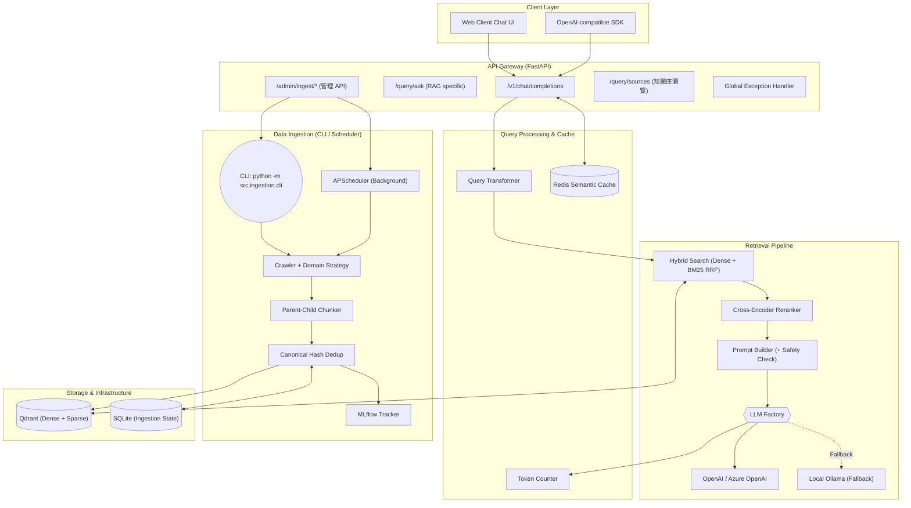

# 🇩🇪 German Visa & Chancenkarte RAG API

[](https://www.python.org/downloads/)
[](https://fastapi.tiangolo.com)
[](https://qdrant.tech/)
[](https://redis.io/)
[](https://opensource.org/licenses/MIT)
[](https://codecov.io/gh/ToooAir/german-visa-rag)

這是一個基於 **進階 RAG (Retrieval-Augmented Generation)** 架構的 API 系統，專門用於解答關於「德國簽證」與「機會卡 (Chancenkarte)」的法規與申請問題。系統支援中、英、德三語提問，並確保所有回答皆基於權威官方來源，附帶精確的引用出處。

本專案依照 **Production-ready** 標準打造，包含自動化網頁爬蟲、狀態去重、混合檢索 (Hybrid Search)、二次重排 (Reranking)、LLM 意圖擴充、**Redis 語意快取**，以及完整的評測與 CI/CD 流程。

## 💡 Motivation: 為什麼建置此專案？(Why build this?)

這個專案起源於我當初申請德國簽證時的親身痛點。在使用 Perplexity 或 ChatGPT + Web Search 等通用型 AI 工具時，我經常遇到兩個致命的瓶頸：

1. **AI 幻覺與錯誤的法規限制 (Hallucinated Constraints)**：通用搜尋引擎很難正確解析具有複雜條件的法律邏輯。舉例來說，在新的「機會卡 (Chancenkarte)」規則中，只要申請者擁有德國認可的大學學歷，就「不需要」額外提供語言證明。然而，Cloud LLM 幾乎無一例外地產生幻覺，堅持要求必須附上德文或英文的語言能力檢定。
2. **缺乏有狀態的推理能力 (Lack of Stateful Reasoning)**：簽證資格判斷並不是單純的「文件搜尋」問題；它需要根據使用者的動態狀態（例如：學歷、年資點數、語言等級）進行結構化、多步驟的條件推理。

我打造這個專案，是為了探索在**「具有複雜業務邏輯與條件分支」**的領域中，**RAG 系統與 LLM 結構化推理的極限與邊界**。我刻意選擇了這個題目來驗證：
- 如何跨越**跨語言檢索的鴻溝**（例如：用中文提問，但精準檢索德文法規）。
- 如何在長對話中實作**狀態壓縮 (State Compression)**，避免 Context Rot。
- 如何透過強制溯源引用的 **UX 透明度設計**，消除對 AI 黑盒子的不信任感。

*針對深入的工程權衡與架構設計，請參閱 [架構決策紀錄 (ADR) - docs/design-decisions_TC.md](docs/design-decisions_TC.md)。*

---

## ✨ 核心特色

### 🔍 進階 RAG 檢索管線
- **Query Transformation**：使用輕量 LLM 進行查詢意圖擴充與拼字修正，解決多語系向量偏移問題。系統會同時生成 `german_query` + `english_query` + `query_variants` 並對全部詞彙進行搜尋，以最大化召回率。
- **Hybrid Search**：結合 **Dense Vector** (OpenAI `text-embedding-3-small`) 與 **Sparse BM25** 進行混合檢索，應用服務器端 **Reciprocal Rank Fusion (RRF)** 進行分數融合。其中的 BM25 Sparse Encoder 採用基於雜湊 (Hash-based) 的自研零依賴 (Zero-dependency) 設計，不須依賴任何外部模型或訓練語料。
- **Cross-Encoder Reranking**：檢索候選數 (`RETRIEVAL_TOP_K_HYBRID = 20`) 後，使用 Reranker（支援 Cohere、Jina 或 Mock 模式）進行語意重排，精煉提取 Top-10 (`RETRIEVAL_TOP_K_RERANKED = 10`) 丟給 LLM。
- **簽證類型上下文過濾**：Retrieval 與 Prompt 會根據 UI 中選定的簽證類別動態調整——支援四種類型：**機會卡 (Chancenkarte)**、**歐盟藍卡 (EU Blue Card)**、**技術移民 (Skilled Worker / FEG 2.0)**、**學生簽證 (Student Visa)**。Prompt Builder 會為每種簽證注入對應的法律門檻（如存款要求、評分規則、語言等級強制條件）。
- **時間感知與權威加權**：優先檢索官方 (`official`) 來源與最新抓取的法規文件，按 `official` > `semi_official` > `third_party` 分層加權。

### 🚀 效能優化與成本控制 (Performance & Cost)
- **Semantic Caching（語意快取）**：整合 Redis 實作 LLM 回答快取，針對重複問題達到 **10 毫秒級**回應，大幅降低 OpenAI Token 成本。
- **Token 計數與成本追蹤**：內建 `TokenCounter` 模組，記錄每次查詢的輸入/輸出 Token 數量並估算 USD 花費，方便進行預算監控。
- **進階 Parent-Child Chunking**：實作「由小到大」策略，並內建 **標題內容注入 (Title Context Injection)** 與 **自動去躁 (Noise Removal)**，確保 80% 更乾淨的 RAG 上下文。

### 🛠️ 工程最佳實踐 (Engineering Excellence)
- **LLM Factory Pattern（多 Provider 支援）**：透過單一 `USE_AZURE_OPENAI` 開關，無縫切換 **OpenAI** 與 **Azure OpenAI**。若主要 Provider 離線，系統可自動降級至本地 **Ollama** 模型，兼顧彈性與韌性。
- **Circuit Breaker + Exponential Backoff**：所有 API 呼叫均包裝 `CircuitBreaker`（達到失敗次數閾值後自動熔斷）與 `tenacity` 指數退避重試邏輯，防止 API 故障時的連鎖崩潰。
- **APScheduler 背景排程器**：`IngestionScheduler` 使用 APScheduler 在 API 進程內執行定時爬取任務，支援 seed URL 模式與自動發現模式，無需外部 Cron 服務即可完成基礎排程。
- **Domain-Specific 爬蟲策略**：每個爬取目標網域皆有獨立的 `DomainCrawlStrategy`，可設定路徑白/黑名單、URL 相關性評分、語言前綴過濾（`/en/`、`/de/`）、Sitemap 自動發現，以及頁面層級的 Authority 指派。
- **獨立 CLI 爬蟲腳本**：將 API 與 ETL (Extract, Transform, Load) 爬蟲解耦。提供專屬的 CLI 指令，完美適配 GCP Cloud Run Job 的 Serverless 排程架構，避免 CPU Throttling。
- **OpenAI 相容 API**：完整實作 `POST /v1/chat/completions`，支援 SSE Streaming。
- **防禦性編程**：內建 Prompt Injection 偵測、全局例外處理 (Global Exception Handler)，以及 API 後端的固定窗口限流機制 (Fixed-Window Rate Limiter)。
- **MLflow 可觀測性**：每次 Ingestion Run 與查詢結果皆記錄至 MLflow Tracking Server，追蹤文件處理數、Chunk 指標與每查詢成本，供實驗比較使用。

---

## 🏗️ 系統架構


```mermaid
graph TB
    subgraph "Client Layer"
        A1["Web Client Chat UI"]
        A2["OpenAI-compatible SDK"]
    end

    subgraph "API Gateway (FastAPI)"
        B1["/v1/chat/completions"]
        B2["/query/ask (RAG specific)"]
        B3["/admin/ingest/* (管理 API)"]
        B4["/query/sources (知識庫瀏覽)"]
        EH["Global Exception Handler"]
    end

    subgraph "Query Processing & Cache"
        C1["Query Transformer"]
        E2[("Redis Semantic Cache")]
        TC["Token Counter"]
    end

    subgraph "Retrieval Pipeline"
        D1["Hybrid Search (Dense + BM25 RRF)"]
        D2["Cross-Encoder Reranker"]
        D3["Prompt Builder (+ Safety Check)"]
        F1{{"LLM Factory"}}
        LLM_A["OpenAI / Azure OpenAI"]
        LLM_B["Local Ollama (Fallback)"]
    end

    subgraph "Data Ingestion (CLI / Scheduler)"
        G0(("CLI: python -m src.ingestion.cli"))
        SCHED["APScheduler (Background)"]
        G1["Crawler + Domain Strategy"]
        G2["Parent-Child Chunker"]
        G3["Canonical Hash Dedup"]
        MLF["MLflow Tracker"]
    end

    subgraph "Storage & Infrastructure"
        E1[("Qdrant (Dense + Sparse)")]
        E3[("SQLite (Ingestion State)")]
    end

    A1 --> B1
    A2 --> B1
    B1 <--> E2
    B1 --> C1 --> D1 --> D2 --> D3
    D3 --> F1
    F1 --> LLM_A
    F1 -. Fallback .-> LLM_B
    F1 --> TC
    D1 <--> E1
    B3 --> G0
    B3 --> SCHED

    G0 --> G1 --> G2 --> G3 --> E1
    SCHED --> G1
    G3 <--> E3
    G3 --> MLF
```

---

## 🚀 快速開始 (Local Development)

### 1. 環境初始化
```bash
git clone https://github.com/ToooAir/german-visa-rag.git
cd german-visa-rag
cp .env.example .env
# 請編輯 .env 並填入 OPENAI_API_KEY
# 若要使用 Azure OpenAI，請設定 USE_AZURE_OPENAI=true 並填入 AZURE_* 相關變數
# (若不填寫且開啟 USE_OLLAMA=true，系統將自動退避至本地模型)
```

### 2. 診斷工具（建議執行）
在啟動系統前，您可以先驗證 API 連線性與額度狀態（OpenAI / Azure）：
```bash
# 驗證連線性並檢查速率限制/額度
export PYTHONPATH=$PYTHONPATH:$(pwd) && python scripts/test_provider.py
```
此腳本會告知您的 API 金鑰是否有效；若遇到限流 (Rate-limited)，它會顯示具體的重置秒數。

### 3. 啟動服務

*💡 提示：本地開發使用 Volume Mount 時，請確保清除 Host 端的 `src/__pycache__` 目錄或新增 `.dockerignore`，以避免舊的 `.pyc` 檔被帶入容器導致服務崩潰。*

```bash
docker-compose up -d
curl -H "X-API-Key: dev-key-12345" http://localhost:8080/v1/health
```

已啟動服務：**API** (`:8080`)、**Qdrant** (`:6333`)、**Redis** (`:6379`)、**MLflow** (`:5000`)

### 4. 前端手動編譯與靜態掛載（非 Docker 開發）
如果您希望在不安裝 Docker 的情況下直接運行 API 並顯示 UI，您需要手動編譯前端並將產出搬移至 `static` 資料夾：
```bash
cd frontend
npm install
npm run build
cd ..
mkdir -p static
cp -r frontend/dist/* static/
# 現在可以啟動 API，它會自動服務 static 內的靜態檔案
python src/main.py
```

若需要前端熱重載開發體驗，請在 `frontend/` 目錄內執行 `npm run dev`，開發伺服器將在 `http://localhost:5173` 啟動。

### 5. 觸發資料攝入（CLI 獨立腳本）
本專案提供專業的 CLI 工具來執行資料爬取，適合打包為 Cronjob 或 Serverless Job：
```bash
# 抓取設定檔中的所有網址
python -m src.ingestion.cli ingest

# 啟用自動發現模式掃描全站網域並抓取
python -m src.ingestion.cli ingest --auto-discover

# 強制重新切片以套用最新的處理邏輯（覆蓋舊資料）
python -m src.ingestion.cli ingest --auto-discover --force

# 僅抓取單一網址測試
python -m src.ingestion.cli ingest --source "https://www.make-it-in-germany.com/en/"

# 乾跑測試：僅執行網址發現而不進行爬取
python -m src.ingestion.cli discover --domain "www.make-it-in-germany.com"

# 查看目前資料庫內的攝入統計數據
python -m src.ingestion.cli status
```

---

## 💻 API 使用範例

本專案高度相容 OpenAI SDK，您可以直接將 Base URL 指向本地服務。

```python
from openai import OpenAI

client = OpenAI(
    api_key="dev-key-12345",
    base_url="http://localhost:8080/v1"  # 指向本地 RAG API
)

response = client.chat.completions.create(
    model="gpt-4o-mini",
    messages=[{"role": "user", "content": "Chancenkarte 的申請條件是什麼？"}],
    stream=True
)

for chunk in response:
    print(chunk.choices[0].delta.content or "", end="")
```

*💡 提示：如果連續發送相同問題，系統將自動命中 Redis 快取，不消耗任何 API Token！*

---

## 📡 SSE 串流結構詳細說明（供 UI 開發者參考）

本專案的 Streaming 響應除了包含內容外，還會傳送「AI 思考過程」的 Metadata，可用於實作類似 Perplexity 的動態進度條：

| Metadata 欄位 | 型別 | 說明 |
| :--- | :--- | :--- |
| `status` | `string` | 管線階段：`analyzing`（分析中）、`retrieving`（檢索中）、`extracting`（提取中）、`synthesizing`（回答中） |
| `search_queries` | `list` | LLM 拆解出的關鍵字搜尋詞，用於向向量資料庫查詢 |
| `sources` | `list` | 本次回答引用的文獻清單，包含 `url`、`title`、`authority` 等資訊 |
| `achieved_milestone` | `object` | 自動偵測到的進度更新：`{ "id": "1-1", "status": "completed" }` |
| `updated_requirement` | `object` | 從對話提取到的用戶屬性：`{ "id": "age", "value": "30", "status": "valid" }` |

---

## 🖥️ 前端功能介紹

React + TypeScript 前端（Vite）是一個完整的多頁面應用程式，具備以下頁面與功能：

- **對話介面（首頁）**：簽證類別選擇器（機會卡 / 歐盟藍卡 / 技術移民 / 學生簽證），將 RAG 上下文聚焦於對應類別。即時串流回答，附帶來源引用。
- **Insights Panel（進度追蹤面板）**：隨著 AI 偵測到對話中的里程碑與條件狀態，即時更新申請進度清單。包含智慧推斷邏輯（例如：若機會卡加分項目已達標，則基礎條件自動推斷為滿足）。
- **知識庫瀏覽頁（`/documents`）**：列出所有已索引的來源文件，附帶權威等級標籤（`official` / `semi_official` / `third_party`）、簽證類型標籤，以及最後抓取時間——由 `/query/sources` API 驅動。
- **設定頁面**：深色/淺色主題切換，以及 UI 語言切換（English / Deutsch / 繁體中文），底層由完整的 i18n 翻譯層支撐。
- **行動裝置響應式設計**：支援安全區域 (Safe Area) 處理與捲動鎖定，提供接近原生 App 的 iOS/Android 瀏覽器體驗。

---

## 🧪 測試與評測（Testing & MLOps）

```bash
# 進入開發容器
docker-compose exec api bash

# 1. 執行單元與整合測試
# 註：容器內可能未預裝 pytest，需先執行 pip install .[test]，
# 或者直接在 Host 環境執行 .venv/bin/python -m pytest。
# 系統目前包含 649 個測試（644 個 Unit tests 全 Mock、5 個 Integration tests 串接真實服務）。
pip install .[test]
pytest tests/ -v --cov=src --cov-report=term-missing

# 2. 執行 Ragas RAG 質量評測（Context Precision & Faithfulness）
python -m eval.ragas_evaluator eval/eval_dataset.json
```

評測結果將自動同步至 MLflow Tracking Server (`http://localhost:5000`) 供視覺化比較分析。

### CI/CD 管線

每次推送至 `main` 或 `develop` 分支，GitHub Actions 會自動執行以下流程：
- 啟動真實的 **Qdrant** 與 **Redis** 服務容器（非 Mock）
- 執行 **Black** 格式檢查、**Ruff** 靜態分析，以及 **mypy** 型別檢查
- 執行完整的 649 個測試並生成覆蓋率報告
- 將覆蓋率結果上傳至 **Codecov**

---

## ☁️ 部署（Deployment）

本專案專為無狀態部署 (Stateless) 設計，推薦架構為 **GCP Cloud Run**（API 服務）+ **GCP Cloud Run Job**（CLI 爬蟲）+ **Qdrant Cloud**。

```bash
./scripts/deploy.sh -e production -p your-gcp-project-id -r europe-west1
```
詳細部署步驟，請參閱 [部署指南 (DEPLOYMENT_TC.md)](docs/DEPLOYMENT_TC.md)。

---

## ⚠️ 免責聲明（Disclaimer）
**本系統為技術展示性質 (Side Project)**。所有回答皆由 AI 生成，**不構成法律意見**。實際申請條件請務必以[德國聯邦外交部](https://www.auswaertiges-amt.de/)或 [Make it in Germany](https://www.make-it-in-germany.com/) 官網為準。
